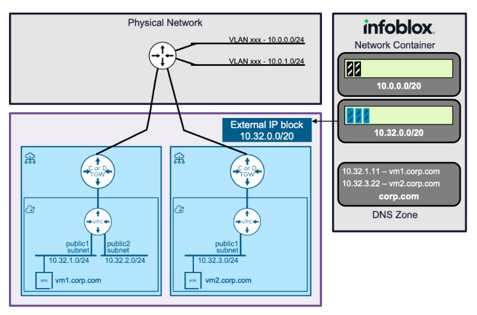

### VPC - Centralized X Distributed Connectivity

#### Version

Infoblox Plugin 1.5 is compatible with Aria Automation 8.9.1 and later and containing all the functionality of previous versions

#### InfoBlox Design

##### Reference
* https://blogs.vmware.com/cloud-foundation/2026/05/15/vcf-networking-9-1-seamless-ddi-integration-with-infoblox/

* https://techdocs.broadcom.com/us/en/vmware-cis/vcf/vcf-9-0-and-later/9-1/infrastructure-operations/network-operationss/working-with-data-sources/adding-a-data-source-in-vrealize-network-insight/supported-dns-data-providers/infoblox.html

* https://vcf.broadcom.com/vsc/services?search=infoblox
