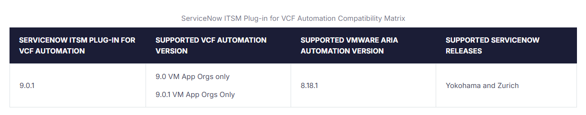

#### Service Now

ServiceNow ITSM Plug-in for VCF Automation only supports VM Apps organizations.

###### Compatibility

###### Reference
* https://techdocs.broadcom.com/us/en/vmware-cis/vcf/vcf-9-0-and-later/9-1/organization-management/vcfa-overview/copy-of-overview-of-vrealize-automation-itsm-application-for-servicenow-user-portal/copy-of-preparation-for-installation/copy-of-compatibility-matrix.html

* https://store.servicenow.com/store/app/0349abae1be06a50a85b16db234bcbbb#licensingRequirements
